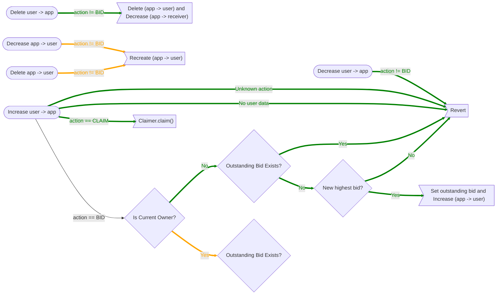

# Draft Proposal - AuctionSuperApp
#proposal

Date :: 2021-12-21
Author :: [[@codynhat]]

## Summary
A smart contract that is a Superfluid [Super App](https://docs.superfluid.finance/superfluid/protocol-tutorials/super-apps) and handles the flows used in the continuous auction of licenses.

## Parameters
| Name                          | Type      | Description                                            |
| ----------------------------- | --------- | ------------------------------------------------------ | 
| `receiver`                    | `address` | Receiver of contributions                              |     
| `dutchAuctionLengthInSeconds` | `uint256` | Length of Dutch auction upon a parcel becoming invalid |
| `penaltyNumerator`            | `uint256` | Numerator of penalty needed on difference of self-assessed values                                                       |
| `penaltyDenominator`          | `uint256` | Denominator of penalty needed on difference of self-assessed values                                                      |

## Storage
| Name                     | Type                                          | Description                                                                   |
| ------------------------ | --------------------------------------------- | ----------------------------------------------------------------------------- |
| `outstandingBid`  | `mapping(uint256 => Bid)` | Stores the highest outstanding bid for a license  |
| `currentOwnerBid` | `mapping(uint256 => Bid)` | Stores the bid for the current owner of a license |

## Models
```solidity
struct Bid {
	uint256 timestamp;
	address bidder;
	uint256 contributionRate;
	uint256 perSecondFeeNumerator;
	uint256 perSecondFeeDenominator;
	uint256 depositAmount;
}
```

## Functions
### SuperApp Callbacks
See diagram.

### Calculate For Sale Price
Calculate the for sale price of an existing license.

```solidity
function calculateForSalePrice(
	uint256 licenseId
) returns (uint256)
```

- `currentOwnerBid > 0`-> Self-assessed value of current owner
- `currentOwnerBid == 0` -> Defer to `Reclaimer`
- License is `0x0` -> Defer to `Claimer`

### Calculate Penalty
Calculate the penalty needed for the current bid to be rejected.

```solidity
function calculatePenalty(
	uint256 licenseId
) returns (uint256)
```

### Pause
Pause and unpause for use in an emergency.

```solidity
function pause() public
```

```solidity
function unpause() public
```

`PAUSE_ROLE` is required.

## Batch Calls
Superfluid [Batch Calls](https://docs.superfluid.finance/superfluid/docs/batch-call) allow for multiple actions to be taken on a Super App in a single transaction.

## Roles
| Name         | Function Access    |
| ------------ | ------------------ |
| `PAUSE_ROLE` | `pause`, `unpause` |

## Required Permissions
None.

## Diagram
![[Pasted image 20220119134401.png]]
